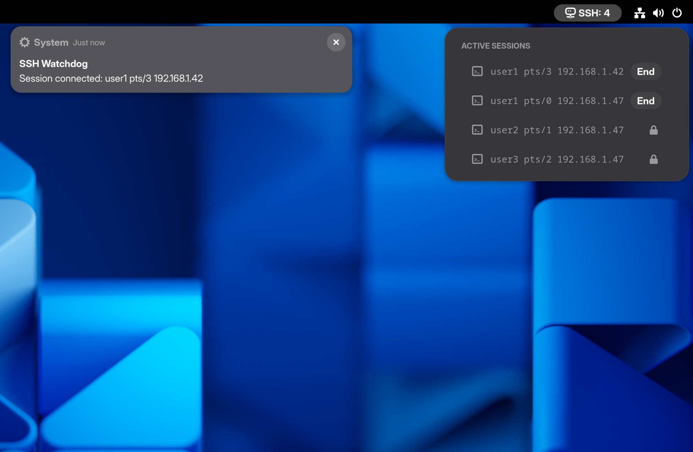
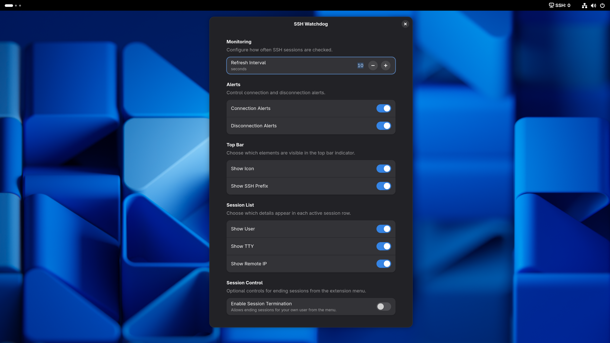

<h1 align="center">&nbsp;SSH Watchdog</h1>

<p align="center">
  Monitor and manage active SSH sessions in the GNOME top bar.
</p>

<p align="center">
  <a href="https://extensions.gnome.org/extension/9343/ssh-watchdog/">
    
  </a>
  <br />
  <samp><a href="https://extensions.gnome.org/extension/9343/ssh-watchdog/">extensions.gnome.org</a></samp>
</p>

## Features

- Top-bar indicator with live SSH session count.
- Dropdown menu listing active SSH sessions (user, TTY, remote IPv4/IPv6).
- Optional per-session connection and disconnection alerts.
- Optional per-session termination controls in the dropdown menu (disabled by default).
- Session termination flow: `End -> Confirm -> ending...` with cancel support.
- Non-terminable sessions (different local user) show a lock indicator instead of an actionable control.
- Session-row field toggles for user, TTY, and remote IP.
- Configurable refresh interval (`1` to `60` seconds).
- Appearance toggles for icon and `SSH:` label prefix.
- Menu refresh when opened, in addition to interval polling.

## Screenshots

| **Connection Notification (With Active Sessions)** | **Confirm Session Termination** |
|---|---|
|  |  |

| **Idle State (No Active Sessions)** | **Preferences** |
|---|---|
|  |  |

## Compatibility

- GNOME Shell `45` through `50`.
- Uses local `who` output as the SSH session data source.

## Runtime Requirements

- `who` available in `PATH`
- Active SSH logins represented in `who` output
- `pkill` available in `PATH` (only required when session termination controls are enabled)

## Preferences (Defaults)

- Refresh interval: `10` seconds (range `1-60`).
- Show icon: `true`.
- Show SSH prefix: `true`.
- Show connection alerts: `true`.
- Show disconnection alerts: `true`.
- Enable session termination: `false`.
- Show user in session rows: `true`.
- Show TTY in session rows: `true`.
- Show remote IP in session rows: `true`.

## Privacy and Data Handling

- No telemetry.
- No outbound network calls.
- Session information is derived locally from the system `who` command output.

## Known Limitations

- If a session is not reported by `who`, it will not appear in the extension.
- Entries where `who` reports only hostnames (not IP addresses) are ignored.
- Connect/disconnect notifications start after the first polling baseline is established.
- Notifications are delivered through GNOME Shell's system notification source.
- Session termination controls only apply to sessions for the currently logged-in user.
- Session controls are shown only when `Enable Session Termination` is enabled in preferences.

## Support

- Report issues: `https://github.com/MiguelRegueiro/ssh-watchdog/issues`
- For diagnostics, collect GNOME Shell logs with:

```bash
journalctl -f -o cat /usr/bin/gnome-shell
```

## Documentation

- Changelog: `CHANGELOG.md`

## Project Layout

- `extension/extension.js`: main extension runtime, notifications, and session actions.
- `extension/prefs.js`: Adwaita preferences UI.
- `extension/schemas/org.gnome.shell.extensions.ssh-watchdog.gschema.xml`: GSettings schema.
- `extension/metadata.json`: extension metadata (UUID, shell compatibility, version).
- `extension/stylesheet.css`: extension styles.
- `LICENSE`: project license (`GPL-3.0-or-later`).

## License

This project is licensed under `GPL-3.0-or-later`. See `LICENSE`.
