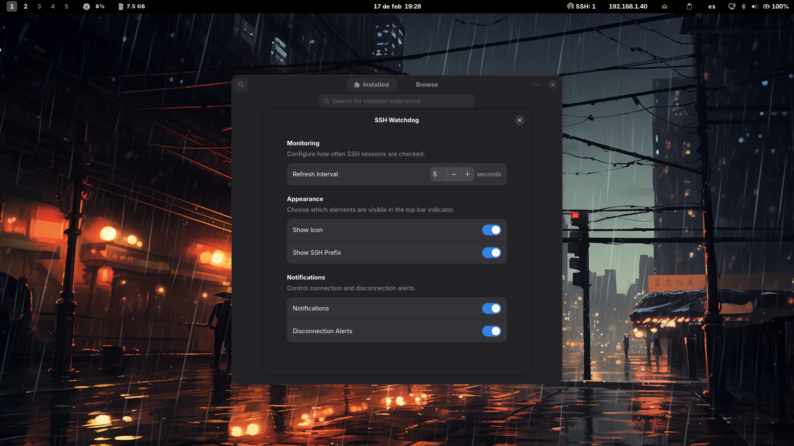

# SSH Watchdog GNOME Extension

<p align="center">
  
</p>

SSH Watchdog is a self-contained GNOME Shell extension for SSH session visibility.

## Interface

|  |  |
|---|---|
| <sub>Idle State</sub><br> | <sub>Session Details</sub><br> |
| <sub>Native Notifications</sub><br> | <sub>Configuration</sub><br> |

## Features

- **Comprehensive Session Visibility:** Features a high-visibility top-bar indicator displaying active SSH session counts (e.g., SSH: N) and a monospaced dropdown menu. This interface itemizes unique remote IPv4 addresses using symbolic iconography and a modern, layout optimized for both aesthetic appeal and rapid technical legibility.
- **Intelligent Notification System:** Provides independent toggles for connection and disconnection alerts, featuring IP-aware state tracking to minimize redundant notifications and optimize user experience.
- **Customization Options:** Provides independent toggles to enable or disable the indicator icon and the SSH: text label for a personalized top-bar footprint. Additionally, users can calibrate the background polling frequency between 1 and 60 seconds (defaulting to 10 seconds) to balance real-time responsiveness with system resource efficiency.

## How It Works

Single runtime component:

1. GNOME extension (`extension/extension.js`)
- Polls on a user-configurable GSettings interval (`1-60s`, default `10s`).
- Executes the session parser command asynchronously with `Gio.Subprocess`.
- Uses `communicate_utf8_async` for non-blocking shell command execution.
- Parses unique IPv4 sources from: `who | grep -oP '\(\K[\d\.]+' | sort -u`.
- Tracks session state transitions (`lastCount` + previous IP set) to detect connects/disconnects.
- Uses `connectObject()` and `disconnectObject()` for signal lifecycle management and cleanup.
- Applies preference changes live without GNOME Shell restart.

## Project Layout

- `extension/extension.js`: main GNOME extension logic + notification handling.
- `extension/prefs.js`: Adwaita-based preferences window.
- `extension/schemas/org.gnome.shell.extensions.ssh-watchdog.gschema.xml`: settings schema.
- `extension/metadata.json`: extension metadata (UUID, name, shell compatibility).
- `extension/stylesheet.css`: UI styles.
- `INSTALL.md`: manual installation instructions.
- `LICENSE`: project license (GPL-3.0-or-later).
- `packaging/`: PKGBUILD/install hooks.

## Compatibility

- Optimized for GNOME Shell `45` through `49` (declared in `metadata.json`).
- Requires `sshd` for SSH sessions and `who` command availability.
- `grep -P` is used for regex extraction.

## Known Limitations

- Current parser intentionally targets IPv4 only (`[\d\.]+`).
- IPv6-only remote hosts are not shown with the current command.
- UI state depends on `who`; if a session is not represented there, it will not appear in the extension.

## Debugging

- GNOME Shell logs:
```bash
journalctl -f -o cat /usr/bin/gnome-shell
```

## Installation

For local/manual installation instructions, see `INSTALL.md`.

## Packaging

- PKGBUILD is in `packaging/PKGBUILD`.
- It fetches release tarballs from:
  - `https://github.com/MiguelRegueiro/ssh-watchdog`
- Schemas are compiled during packaging and in the install hook.

## Changelog

### v1.0.3

- Refactored command execution to an asynchronous model using `Gio.Subprocess` + `communicate_utf8_async`.
- Replaced manual signal ID tracking with `connectObject()` / `disconnectObject()`.
- Removed `schemas/gschemas.compiled` from extension payload (GNOME 45+ compliant packaging).
- Updated settings access to parameterless `getSettings()` based on `metadata.json`.
- Improved runtime lifecycle cleanup for disable/destroy paths and async guard handling.
- Updated preferences interval control to `Adw.SpinRow` for a modern Adwaita UI flow.
